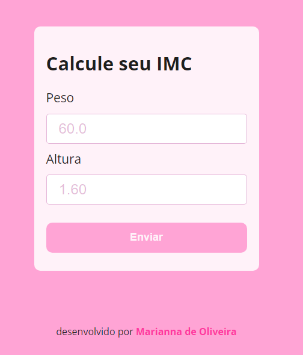
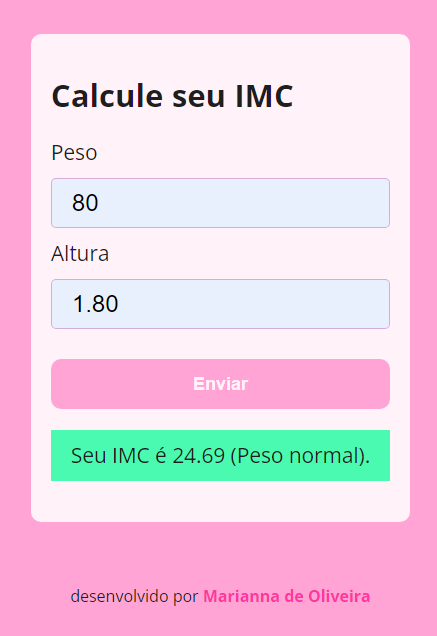
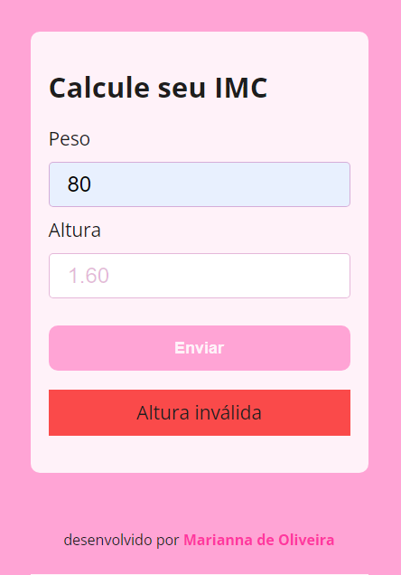

# Calculadora IMC

Nesse projeto foram aplicados alguns dos primeiros conhecimentos de lógica e manipulação de DOM.

## Sobre o programa

Durante o desenvolvimento do projeto fizemos algumas funções, sendo elas:

*getImc()* - essa função recebe como parâmetro o peso e a altura, fornecidos pelo usuário, e realiza o cálculo baseado na fórmula criada pelo matemático Lambert Quételet em 1835 e adotada pela OMS em 1997, onde:

    imc = peso / altura ** 2 

*getNivelImc()* - ela recebe o IMC calculado pela função getImc() e, baseado no valor recebido, classifica o indivíduo em uma das 6 categorias possíveis, sendo elas:

- Abaixo do peso
- Peso normal
- Sobrepeso
- Obesidade grau 1
- Obesidade grau 2
- Obesidade grau 3

Dentro do método ```*addEventListener()*``` foi feita uma função anonima. Nela temos validação de tipo e, de acordo com o resultado, possuimos uma alteração no DOM.

## Screenshots
### Tela inicial


### Resultado bem sucedido


### Resultado em caso de erro


### Hover no botão


## Referência

[Curso de JavaScript e TypeScript do Básico ao Avançado - Udemy](https://www.udemy.com/course/curso-de-javascript-moderno-do-basico-ao-avancado/)

## Conclusão
Nesse projeto pude aprender melhor o uso de operadores lógicos, operador ternário, if/else, usar o operador de negação (!), criação de funções e manipulação de DOM.
